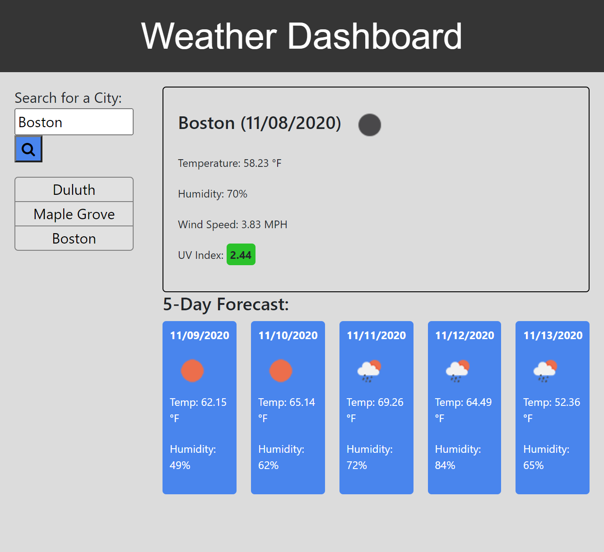
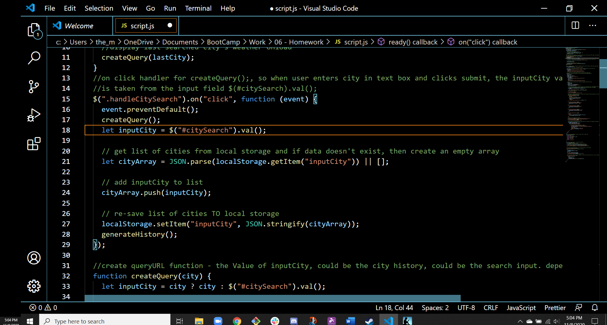

# Weather Dashboard Using OpenWeather and Moment.js APIs

## Overview

The client expressed needs for an application that provides weather outlook for multiple cities, so they can plan their trips.

## Client's Needs/Expectations

The client, a traveler who will be visiting multiple cities, established that the following needs/expecations must be met:

- The weather outlook application must allow the traveler to search for the weather outlook for mulitple cities, by their name.
- The app will run in the browswer and feature dynamically updated HTML and CSS powered by JQeury.
- Moment.js library is to be used to work with date and time and OpenWeather API to retrieve weather data for cities.

## Updates and Exepctations Obtained from the Traveler, Traveling to Multiple Cities

Through information and feedback provided by the traveler who is traveling to multiple cities, the following criteria were established:

- The traveler is using the weather dashboard to find the outlook for multiple cities, so that they can plan their trip accordingly.
- When the traveler opens the app :
  - There are from inputs to search for a city.
    - When the traveler searches for a city:
    - They are presented with current and future conditions and that city is added to the search history.
      - When they view current weather conditions for that city
      - Then they are presented with the city name, the date, and icon representation of weather conditions, the temperature, the humidity, the wind speed and the UV index.
      - When the the traveler views the UV index
      - Then the they are presented with a color that indicates whether the conditions are favorable, moderate or severe.
- When the traveler views future weather conditions for that city .
- Then they are presented a 5-day forecast that displays the date, an icon representation of weather conditions, the temperature, and the humidity
- When the traveler clicks on a city in the search history
- Then they are again presented with current and future conditions for that city
- When the traveler open the weather dashboard
- Then they are presented with the last searched city forecast

## Overall Deployment of Weather Dashboard

- The \$(document).ready(function) is employed so the the JQuery events and AJAX calls won't fire until their designated times.
- On load of page: a search input and search button are present to enter a city name in order to obtain its weather forecast.
- Also on load of page, if the (lastSearched === null), then the cityArray open array will begin.
- When the traveler inputs the city name into the text box and clicks the search button, event listeners and functions are triggered for:

  - The city name inputed into the text box or clicked saved city to be saved to local storage and be rendered with a for loop on the page as text inside a clickable button.
  - A first AJAX call is made to Current Weather Data API to obtain the latitude and longitude of the city.
  - The last AJAX call is made to One Call API using the latitude and longitude from the first call to obtain the current weather conditions and the extended forecast in imperial, and UV index.
  - JQuery is used to render in a card and append divs to contain the current day's weather.
  - The dt from the AJAX call is passed through moment.unix().format(M/DD/YYY) to format the date.
  - The weatherIcon variable is created from the second AJAX call for the weather information (uvExtendedData.current.weather[0].icon).
  - The iconURL variable is created from OpenWeather's URL for icon images ("https://openweathermap.org/img/wn/") + the weather icon data from the AJAX call ("weatherICON) + ".png" for the image format.
  - The current temperature is obtained from (uvExtendedData.current.temp).
  - The current humidity is obtained from (uvExtendedData.current.humidity).
  - The current wind speed is obtained from (uvExtendedData.current.wind_speed).
  - The current UV index is obtained from (uvExtendedData.current.uvi) and a function with if statements adds CSS colors based on if the UV index conditions are favorable, moderate, extreme or undefined.

- JQuery is used to render in five cards and append divs inside each to contain the 5-day forecast.
- .map and and an if statement is used to display the searched city's 5-day forecast consisting of: the date, weather icon, temperature and humidty.
- (day.dt) from the AJAX call is passed through moment.unix().format(M/DD/YYYY) to format the dates.
- (day.weather[0].icon is obtained to show the weather icons.
- The 5-day forecast temperatures are otbained from (day.temp.day).
- The 5-day forecast humidities are otbained from (day.humidity).
- When the traveler refreshes the application, the saved city(cities) persist as clickable button(s) and the last searched city's current weather information is presented, due to the retrieval of data from local storage and subtracting one from the retrieved array.
  - Since the traveler's searched city(cities) will be generated from an input, JSON.parse and JSON.strigify are used to set and retrieve the searched city(cities) from the client side local storage.

## Deployed Website and JQuery Code with AJAX calls

\*[Deployed website](https://kay0s.github.io/Server-Side-APIs-Weather-Dashboard/) \*[GitHub Repository](https://github.com/Kay0s/Server-Side-APIs-Weather-Dashboard)

## Research Resources

- [OpenWeather - Current weather data](https://openweathermap.org/current)
- [OpenWeather - Once Call API](https://openweathermap.org/api/one-call-api)
- [EPA - UV Index](https://www.epa.gov/sunsafety/uv-index-1)
- [MomentJS.com - Unix Timestamp](https://momentjs.com/docs/#/parsing/unix-timestamp-milliseconds/)
- [MDN web docs - Array.prototype.map()](https://developer.mozilla.org/en-US/docs/Web/JavaScript/Reference/Global_Objects/Array/map)
- [MDN web docs - :last-child](https://developer.mozilla.org/en-US/docs/Web/CSS/:last-child)
- [Flaviocopes.com - CSS Selectors](https://flaviocopes.com/css-selectors/)
- [CSS Guidelines](https://cssguidelin.es/)

© 2020 Kristina Hamilton and Trilogy Education Services, a 2U, Inc. brand. All Rights Reserved.
